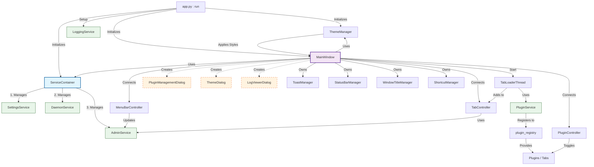

# GUI Architecture Flowchart

This file contains a Mermaid diagram describing the architecture of the GUI submodule.
You can view this diagram by opening this file in an editor that supports Mermaid (like VS Code with the "Markdown Preview Mermaid Support" extension) or by copy-pasting the code block below into [Mermaid Live Editor](https://mermaid.live).

